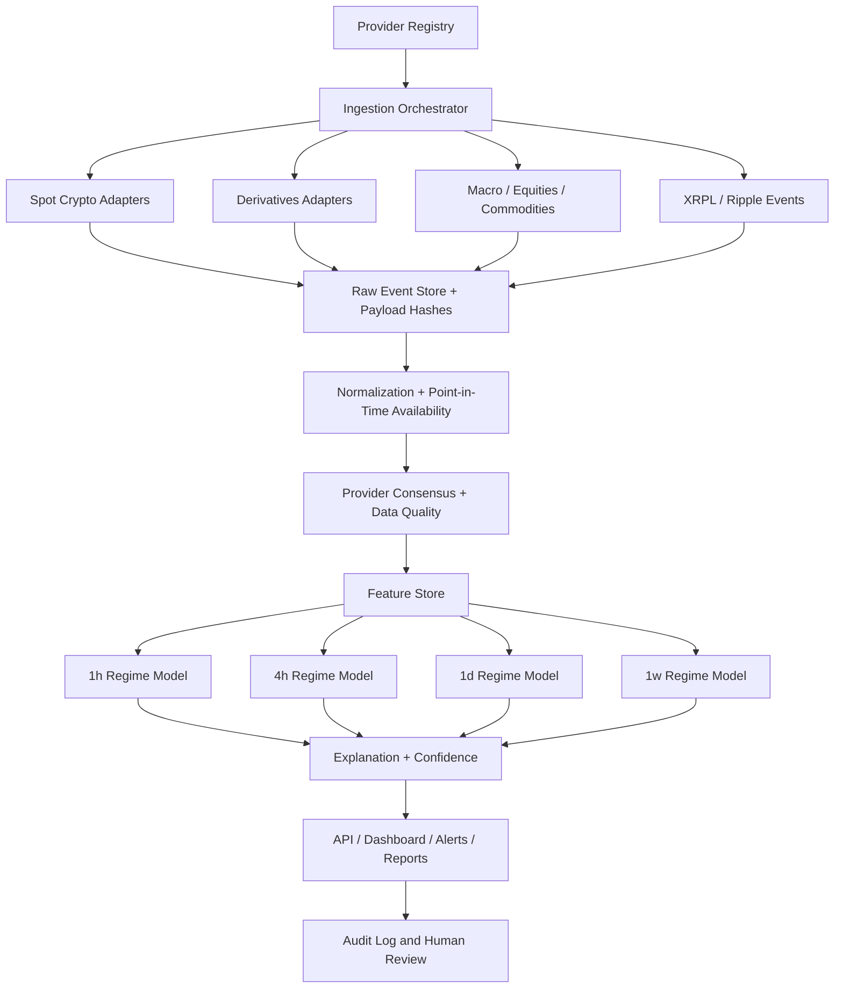

# System Architecture

## Data planes

### Raw plane

Immutable provider payload reference, response hash, fetch timestamp, source URI, status and licence metadata.

### Normalized plane

Canonical symbols, UTC timestamps, units and point-in-time availability. No feature logic is allowed here.

### Feature plane

Versioned features with training window and source coverage. Every feature snapshot points to the normalized observations used.

### Decision plane

Horizon-specific regime scores, confidence, drivers, invalidations and historical analogues.

## Failure semantics

- A provider outage lowers coverage and confidence.
- A provider conflict creates a `CONFLICT` flag and can block alerts.
- Stale spot data blocks intraday outputs but may not block weekly macro reports.
- Missing derivatives data degrades `1h/4h` more heavily than `1w`.
- Revised macro data must not rewrite historical backtest inputs without a new dataset version.
